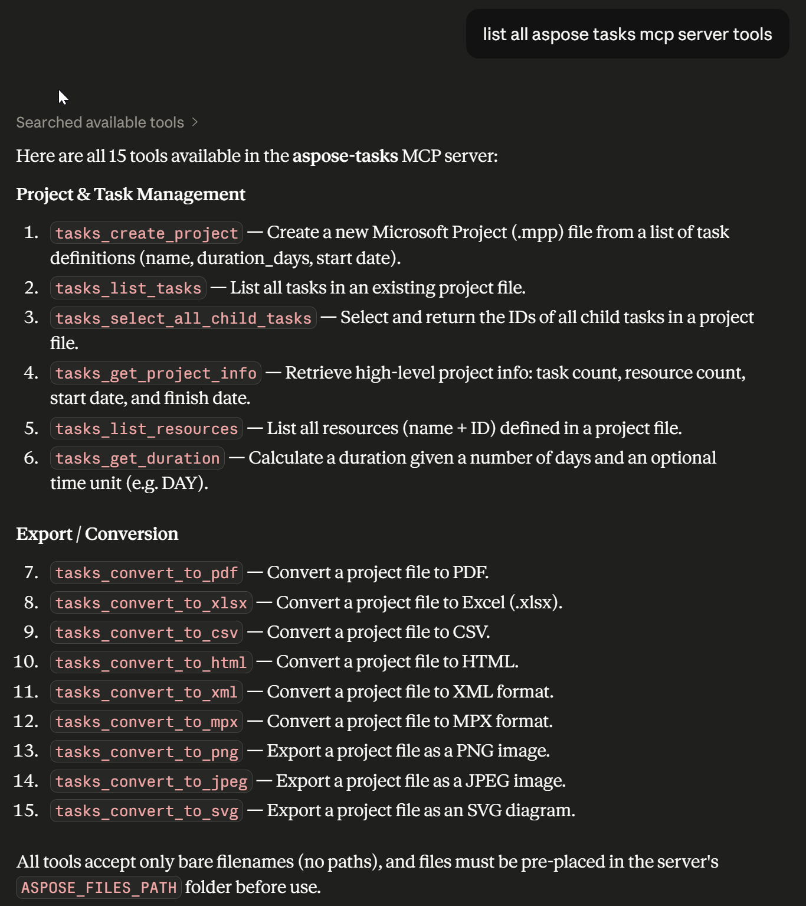
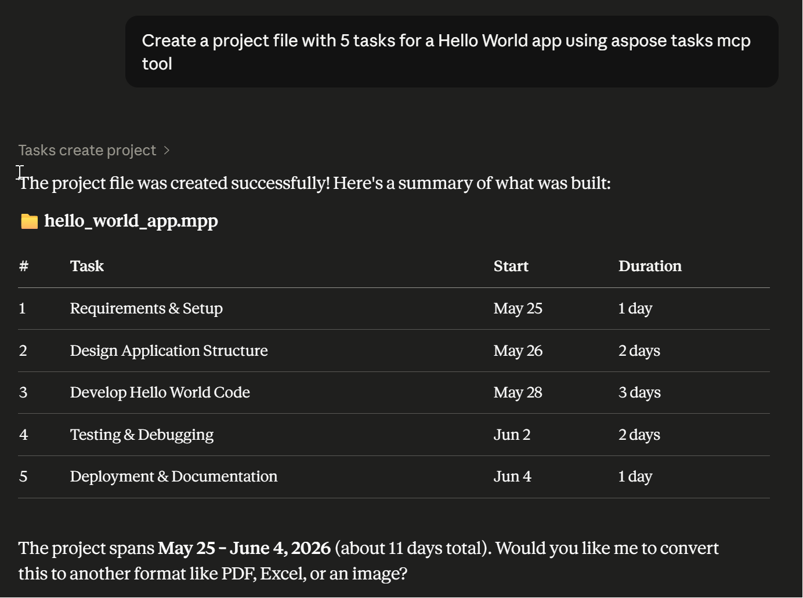
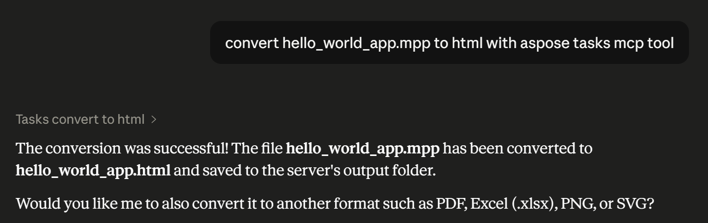

# Aspose.Total for Python via .NET MCP Servers

MCP (Model Context Protocol) servers for [Aspose](https://www.aspose.com/) document
processing products. Connect your AI assistant to Aspose tools for working with Word
documents, PDFs, spreadsheets, presentations, email, images, and more — all without
leaving your AI client.

Each Aspose product runs as its own isolated MCP server.

---

## Requirements

- Python 3.10 or later (Python 3.12 required for CAD)
- An MCP-compatible AI client (Claude Desktop, VS Code, Cursor, Cline, Windsurf, etc.)
- An [Aspose license](https://purchase.aspose.com/) (optional — free evaluation mode available)

---

## Setup

### 1. Clone the repository

```bash
git clone https://github.com/aspose-total/Aspose.Total-for-Python-via-.NET-MCP-Server
cd Aspose.Total-for-Python-via-.NET-MCP-Server
```

### 2. Set up venvs

Run the setup script from the `servers/` folder. It creates an isolated virtual
environment for each product and installs the required Aspose package.

**Windows — all products:**
```bat
servers\setup_all.bat
```

**Windows — specific products only:**
```bat
servers\setup_all.bat ocr words pdf cells slides
```

**macOS / Linux — all products:**
```bash
bash servers/setup_all.sh
```

**macOS / Linux — specific products only:**
```bash
bash servers/setup_all.sh ocr words pdf cells slides
```

### 3. Create a files directory

All tools read input files from and write output files to a single directory you control.
Create it anywhere, e.g.:

```
C:\asposefiles        (Windows)
~/asposefiles         (macOS / Linux)
```

Drop your input files (Word docs, PDFs, images, etc.) into this folder before calling
any tool.

### 4. Configure your AI client

Add one entry per product to your MCP host config. Every entry follows the same pattern —
only the product name changes.

**Two environment variables are required for each entry:**

| Variable | Value |
|----------|-------|
| `ASPOSE_FILES_PATH` | Path to the directory created in step 3 |
| `ASPOSE_LICENSE_FILE` | Full path to your `.lic` file (omit to use evaluation mode) |

---

#### Claude Desktop

Config file location:

| Platform | Path |
|----------|------|
| Windows (direct install) | `%APPDATA%\Claude\claude_desktop_config.json` |
| Windows (Store install) | `%LOCALAPPDATA%\Packages\Claude_pzs8sxrjxfjjc\LocalCache\Roaming\Claude\claude_desktop_config.json` |
| macOS | `~/Library/Application Support/Claude/claude_desktop_config.json` |

```json
{
  "mcpServers": {
    "aspose-words": {
      "command": "C:\\path\\to\\mcp-aspose-python\\servers\\words\\.venv\\Scripts\\python.exe",
      "args": ["C:\\path\\to\\mcp-aspose-python\\servers\\words\\server.py"],
      "env": {
        "ASPOSE_FILES_PATH": "C:\\asposefiles",
        "ASPOSE_LICENSE_FILE": "C:\\asposefiles\\Conholdate.Total.Product.Family.lic"
      }
    },
    "aspose-pdf": {
      "command": "C:\\path\\to\\mcp-aspose-python\\servers\\pdf\\.venv\\Scripts\\python.exe",
      "args": ["C:\\path\\to\\mcp-aspose-python\\servers\\pdf\\server.py"],
      "env": {
        "ASPOSE_FILES_PATH": "C:\\asposefiles",
        "ASPOSE_LICENSE_FILE": "C:\\asposefiles\\Conholdate.Total.Product.Family.lic"
      }
    }
  }
}
```

On macOS / Linux use forward slashes and `.venv/bin/python` instead of `.venv\Scripts\python.exe`.

Fully **quit and restart** Claude Desktop after editing (File → Quit, not just close the window).

> Claude Desktop app supports MCP. The claude.ai browser tab does not.

---

#### VS Code (`.vscode/mcp.json`)

```json
{
  "servers": {
    "aspose-words": {
      "type": "stdio",
      "command": "/path/to/mcp-aspose-python/servers/words/.venv/bin/python",
      "args": ["/path/to/mcp-aspose-python/servers/words/server.py"],
      "env": {
        "ASPOSE_FILES_PATH": "/home/user/asposefiles",
        "ASPOSE_LICENSE_FILE": "/home/user/asposefiles/Conholdate.Total.Product.Family.lic"
      }
    }
  }
}
```

#### Cursor (`~/.cursor/mcp.json`), Cline, Windsurf, Kiro, Zed

Same JSON shape as VS Code — just use the appropriate config file location for each tool.

---

## Available products

| Server key | Product | Handles |
|------------|---------|---------|
| `aspose-words` | [Aspose.Words](https://products.aspose.com/words/python-net/) | DOCX, DOC, RTF, ODT, Markdown |
| `aspose-pdf` | [Aspose.PDF](https://products.aspose.com/pdf/python-net/) | PDF create, convert, extract, sign |
| `aspose-cells` | [Aspose.Cells](https://products.aspose.com/cells/python-net/) | XLSX, XLS, CSV, ODS |
| `aspose-slides` | [Aspose.Slides](https://products.aspose.com/slides/python-net/) | PPTX, PPT, ODP |
| `aspose-email` | [Aspose.Email](https://products.aspose.com/email/python-net/) | MSG, EML, PST, MBOX, MHTML |
| `aspose-ocr` | [Aspose.OCR](https://products.aspose.com/ocr/python-net/) | Image/scan → text extraction |
| `aspose-imaging` | [Aspose.Imaging](https://products.aspose.com/imaging/python-net/) | PNG, JPEG, TIFF, BMP, SVG, WebP |
| `aspose-barcode` | [Aspose.BarCode](https://products.aspose.com/barcode/python-net/) | Generate and read barcodes / QR codes |
| `aspose-zip` | [Aspose.ZIP](https://products.aspose.com/zip/python-net/) | ZIP, RAR, 7z, TAR |
| `aspose-html` | [Aspose.HTML](https://products.aspose.com/html/python-net/) | HTML ↔ PDF/image conversion |
| `aspose-psd` | [Aspose.PSD](https://products.aspose.com/psd/python-net/) | Photoshop PSD / PSB files |
| `aspose-svg` | [Aspose.SVG](https://products.aspose.com/svg/python-net/) | SVG processing and conversion |
| `aspose-tex` | [Aspose.TeX](https://products.aspose.com/tex/python-net/) | TeX / LaTeX typesetting |
| `aspose-page` | [Aspose.Page](https://products.aspose.com/page/python-net/) | XPS, EPS, PS files |
| `aspose-cad` | [Aspose.CAD](https://products.aspose.com/cad/python-net/) | DWG, DXF, DWF and other CAD formats |
| `aspose-3d` | [Aspose.3D](https://products.aspose.com/3d/python-net/) | FBX, OBJ, STL, GLTF and 3D formats |
| `aspose-tasks` | [Aspose.Tasks](https://products.aspose.com/tasks/python-net/) | MPP, MPT (Microsoft Project files) |
| `aspose-diagram` | [Aspose.Diagram](https://products.aspose.com/diagram/python-net/) | VSD, VSDX (Visio diagrams) |
| `aspose-finance` | [Aspose.Finance](https://products.aspose.com/finance/python-net/) | XBRL, iXBRL financial reports |

---

## How it works

Each product runs as a separate MCP server process with its own Python virtual environment. Separate venvs guarante complete isolation.

All tools accept a **bare filename** (e.g. `report.docx`) and resolve it against
`ASPOSE_FILES_PATH` automatically. Never pass full paths to tool parameters.

List all tools of an aspose mcp server with a prompt like "list all aspose tasks mcp server tools"

Run an individual aspose mcp tool with a prompt like "Create a project file with 5 tasks for a Hello World app using aspose tasks mcp tool"

### Listing all available tools



### Creating a hello world project



### Converting a project file to HTML



---

## Troubleshooting

| Symptom | Fix |
|---------|-----|
| No tools appear in the AI client | Verify `command` points to the product's `.venv` Python, not the system Python. Fully restart the client. |
| `ModuleNotFoundError: No module named 'aspose.xxx'` | Run `setup_venv.bat` (or `.sh`) for that product — the venv is missing or incomplete. |
| File not found errors | Confirm `ASPOSE_FILES_PATH` is set and your file is in that directory. |
| Watermarked or limited output | Set `ASPOSE_LICENSE_FILE` to your `.lic` file path. |
| CAD server fails to start | `aspose-cad` requires Python 3.12. Ensure `py -3.12` is available before running `setup_venv.bat`. |

